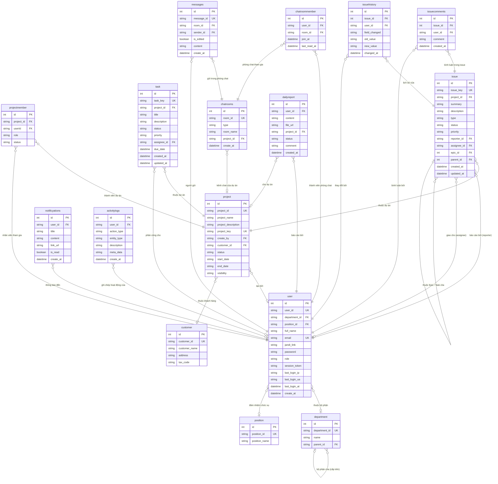

# Sò đồ Quan hệ Thực thể (Entity Relationship Diagram - ERD)

Tài liệu này mô tả cấu trúc các bảng và mối quan hệ giữa các thực thể trong cơ sở dữ liệu MySQL của hệ thống TOPVSystem (TopEng Manager).

## Biểu đồ ERD (Mermaid)

## Chi tiết các Thực thể (Tables)

1. **user (Nhân viên / Tài khoản)**: Lưu trữ thông tin tài khoản nhân viên, phân quyền hệ thống và cơ cấu bộ phận.
2. **department (Phòng ban / Part)**: Tổ chức phân cấp phòng ban (Team -> Part).
3. **position (Chức vụ)**: Các vị trí chuyên môn của nhân sự.
4. **customer (Khách hàng)**: Đối tác liên quan đến dự án.
5. **project (Dự án)**: Thông tin cốt lõi về dự án công ty.
6. **projectmember (Thành viên Dự án)**: Bảng liên kết quản lý nhân viên tham gia vào dự án với vai trò tương ứng.
7. **task (Công việc)**: Các task cơ bản trong dự án.
8. **issue (Sự vụ / Task Jira style)**: Các yêu cầu, lỗi, Epic hoặc task chi tiết hỗ trợ quản lý quy trình.
9. **issuecomments (Bình luận)**: Trao đổi trong các sự vụ.
10. **issuehistory (Lịch sử thay đổi)**: Audit log theo dõi thay đổi thông tin của issue.
11. **chatrooms (Phòng chat)**: Các cuộc hội thoại nhóm hoặc cá nhân (tích hợp).
12. **chatroommember (Thành viên Phòng chat)**: Danh sách người dùng tham gia các phòng chat.
13. **messages (Tin nhắn)**: Nội dung tin nhắn chat.
14. **dailyreport (Báo cáo ngày)**: Báo cáo công việc hàng ngày gửi cho Team Leader duyệt.
15. **notificyations (Thông báo)**: Trung tâm thông báo đẩy cho người dùng.
16. **activitylogs (Nhật ký hệ thống)**: Log toàn bộ hành động bảo mật, đăng nhập, thay đổi nhân sự.
