# Thiết kế hệ thống quản lý doanh nghiệp (MySQL Version)

## Mục lục
1. [Tổng quan & Phân quyền (6 Vai trò)](#1-tổng-quan--phân-quyền-6-vai-trò)
2. [Module Quản lý Dự án](#2-module-quản-lý-dự-án)
3. [Module Quản lý Công việc & Chat trực tiếp](#3-module-quản-lý-công-việc--chat-trực-tiếp)
4. [Module Quản lý Issues (Vấn đề dự án)](#4-module-quản-lý-issues-vấn-đề-dự-án)
5. [Module Trò chuyện & Tagging](#5-module-trò-chuyện--tagging)
6. [Module Quản lý Tài liệu](#6-module-quản-lý-tài-liệu)
7. [Module Nhật ký hoạt động (Audit Logs)](#7-module-nhật-ký-hoạt-động-audit-logs)
8. [Sơ đồ ERD chi tiết cho MySQL](#8-sơ-đồ-erd-chi-tiết-cho-mysql)
9. [Kiến trúc kỹ thuật Backend & Cơ chế phân quyền](#9-kiến-trúc-kỹ-thuật-backend--cơ-chế-phân-quyền)

---

## 1. Tổng quan & Phân quyền (6 Vai trò)

Hệ thống quản lý doanh nghiệp đã được thiết kế lại để chuyển đổi toàn bộ cơ sở hạ tầng lưu trữ từ Supabase (PostgreSQL) sang **MySQL**.
Do MySQL không hỗ trợ cơ chế Row-Level Security (RLS) ở mức cơ sở dữ liệu giống như Supabase, hệ thống thực hiện kiểm tra quyền truy cập ở **Tầng Logic Ứng dụng (Application/Backend Middleware)** trước khi thực hiện truy vấn cơ sở dữ liệu.

### Ma trận phân quyền 6 vai trò chính (Enforced in App Backend)

Hệ thống được thiết kế với 6 vai trò người dùng cụ thể, tuân thủ nghiêm ngặt theo bảng yêu cầu nghiệp vụ:

| Vai trò | Hệ thống (Cấu hình / User / Logs) | Dự án (Thêm / Xóa / Sửa plan) | Tiến độ & Task (Cập nhật / Giao việc) | Task Actions (Sửa / Xóa) | Issues (Đăng / Đổi trạng thái) | Chat & Tagging | Trang công khai |
| :--- | :---: | :---: | :---: | :---: | :---: | :---: | :---: |
| **Quản trị viên (Admin)** | **Có** | **Có** | **Có** | **Có** | **Có** / **Có** | Toàn quyền tag, Chat | **Có** |
| **Nhân sự (HR)** | Chỉ User & Phân quyền | Không | Không | Không | Không / Không | Chỉ xem/Chat, Hỏi trước | **Có** |
| **Nhân viên (Staff)** | Không | Không | Không | Không | **Có** / **Người đăng & được tag** | Xem project chat, không tag | **Có** |
| **Leader/Part Leader** | Không | Không | **Có** | **Có** (Sửa/Xóa) | **Có** / Không | Chat project, tag @all project | **Có** |
| **Kinh doanh (Sales)** | Không | **Có** | Không | Không | Không / Không | Chat, tag @all, Hỏi trước | **Có** |
| **Ban điều hành (BOD)** | Không | **Có** | Không | **Có** (Sửa/Xóa) | Không / Không | Chat, tag @all global, Hỏi trước | **Có** |

---

## 2. Module Quản lý Dự án

**Thực thể chính**: `projects`, `project_members`

**Chức năng & Phân quyền:**
* **CRUD dự án**: Chỉ Admin, Kinh doanh (Sales), và Ban điều hành (BOD) được phép tạo mới dự án, điều chỉnh kế hoạch (end date, yêu cầu khách hàng) hoặc xóa dự án.
* **Gán thành viên**: Dự án liên kết với nhiều người dùng qua bảng `project_members`. Gồm các vai trò nội bộ dự án: `PM` (Quản lý dự án), `Member` (Thành viên).
* **Quản lý tiến độ**: Admin và Leader có quyền cập nhật tiến trình dự án.
* **Danh sách Dashboard**:
  * Admin, Leader, Sales, BOD được xem Dashboard danh sách tổng quan tất cả dự án (`Dashboard list dự án`).
  * Nhân viên (Staff) và Leader được xem danh sách dự án mà mình thực tế tham gia (`Dashboard list dự án tham gia`). Nhân viên không được phép xem các dự án họ không tham gia.
  * Nhân sự (HR) không hiển thị Dashboard dự án.

---

## 3. Module Quản lý Công việc & Chat trực tiếp

**Thực thể chính**: `tasks`, `subtasks`, `task_comments`, `task_chats`

**Chức năng & Phân quyền:**
* **Giao việc & Xem danh sách**: Admin và Leader có quyền giao việc cho nhân viên. Các vai trò Admin, HR, Nhân viên, Leader, Sales có thể xem danh sách task được giao cho họ và cập nhật trạng thái của chúng (To do, In Progress, Review, Done).
* **Sửa & Xóa công việc**: Chỉ Admin, Leader và BOD có quyền chỉnh sửa nội dung hoặc xóa công việc.
* **Chat trên Task**: Tích hợp luồng trò chuyện trực tiếp giữa người nhận việc và người giao việc ngay trên Tab chi tiết của Task (thực thể `task_chats`), cho phép phản hồi thông tin nhanh chóng.
* **Trang công khai**: Hệ thống cung cấp chế độ xem công khai (`/public/projects/[id]`). Bất kỳ ai (kể cả không đăng nhập) cũng có thể truy cập để xem tiến độ tổng quan và danh sách công việc của dự án được cấu hình cho phép hiển thị công khai.

---

## 4. Module Quản lý Issues (Vấn đề dự án)

**Thực thể chính**: `project_issues`, `project_issue_tags`

Nhằm bổ sung chức năng quản lý lỗi và vướng mắc kỹ thuật trong quá trình thực hiện dự án:
* **Đăng Issue**: Admin, Nhân viên và Leader được quyền tạo mới Issue gắn với dự án cụ thể. Mỗi issue bắt buộc đi kèm với mô tả nội dung, mức độ ảnh hưởng và tài liệu báo cáo đính kèm (hoặc link báo cáo).
* **Tagging thành viên**: Khi tạo issue, người đăng có thể tag các thành viên cụ thể trong dự án hoặc chọn tag "Cả nhóm dự án".
* **Đổi trạng thái Issue**: Để đảm bảo tính chặt chẽ, chỉ **người đăng issue** và **những thành viên được tag** mới có quyền chỉnh sửa/đóng trạng thái issue. Nếu issue được tag "Cả nhóm dự án", toàn bộ thành viên trong dự án đó đều có quyền sửa trạng thái.

---

## 5. Module Trò chuyện & Tagging

**Thực thể chính**: `chat_rooms`, `chat_room_members`, `messages`, `message_attachments`

**Quy trình chat & phân quyền:**
* **Kênh chung công ty**: Chỉ Admin, HR, Leader, Sales và BOD có quyền tham gia thảo luận trong kênh chung. Nhân viên thông thường chỉ có chế độ xem (Read-only) hoặc không có quyền truy cập tùy cấu hình.
* **Nhóm chat dự án**: Chỉ các thành viên có tên trong dự án (và HR/Admin) mới được phép tham gia và xem nội dung.
* **Tự động Tag @all**:
  * Ở kênh chung toàn công ty: Chỉ Admin, Sales và BOD được dùng tính năng tag @all.
  * Ở kênh dự án: Admin, Leader và Sales được dùng tính năng tag @all.
* **Hỏi trước khi gửi tin (Ask before send)**: Các vai trò Admin, HR, Sales, BOD khi gửi tin nhắn hàng loạt hoặc gửi tin nhắn thông báo quan trọng sẽ hiển thị hộp thoại xác nhận trước khi tin nhắn được phát đi.

---

## 6. Module Quản lý Tài liệu

**Thực thể chính**: `documents`, `document_categories`, `document_versions`

Tài liệu được phân thành 3 loại chính:
1. **Tài liệu đào tạo**: Quy trình tuyển dụng, onboarding dành cho nhân sự và nhân viên mới.
2. **Tài liệu chung**: Chính sách, quy định của công ty.
3. **Tài liệu vòng đời dự án**: Gắn liền với từng pha của dự án (Khởi tạo, Lập kế hoạch, Thực thi, Giám sát, Kết thúc).
* **Version Control**: Quản lý lịch sử phiên bản tài liệu. Mỗi lần cập nhật file mới sẽ tăng phiên bản lên +1 mà không ghi đè file cũ.

---

## 7. Module Nhật ký hoạt động (Audit Logs)

**Thực thể chính**: `activity_logs`

* Ghi lại mọi hành động phát sinh trên hệ thống (Ai, làm gì, trên thực thể nào, lúc nào).
* Hỗ trợ chức năng tra cứu dữ liệu nhật ký hệ thống nâng cao.
* **Quyền xem nhật ký**: Chỉ Quản trị viên (Admin) mới có quyền xem toàn bộ nhật ký hệ thống. Nhân sự (HR) có quyền tra cứu dữ liệu phục vụ đánh giá nhân sự nhưng không xem được log cấu hình hệ thống chuyên sâu. Các vai trò khác hoàn toàn bị chặn truy cập.

---

## 8. Sơ đồ ERD chi tiết cho MySQL

Dưới đây là sơ đồ quan hệ thực thể (Entity Relationship Diagram) được thiết kế tối ưu hóa cho MySQL:

```mermaid
erDiagram
    roles {
        int id PK
        varchar_50 name
        varchar_255 description
    }
    users {
        varchar_36 id PK
        varchar_100 full_name
        varchar_100 email
        varchar_255 password_hash
        int role_id FK
        varchar_7 color
        datetime created_at
    }
    projects {
        varchar_36 id PK
        varchar_255 name
        text description
        varchar_50 status
        date start_date
        date end_date
        varchar_36 created_by FK
        boolean is_public
        datetime created_at
    }
    project_members {
        int id PK
        varchar_36 project_id FK
        varchar_36 user_id FK
        varchar_50 project_role
        datetime joined_at
    }
    project_issues {
        varchar_36 id PK
        varchar_36 project_id FK
        varchar_255 title
        text description
        varchar_50 status
        varchar_36 reported_by FK
        varchar_255 report_url
        boolean tag_team
        datetime created_at
    }
    project_issue_tags {
        int id PK
        varchar_36 issue_id FK
        varchar_36 user_id FK
    }
    tasks {
        varchar_36 id PK
        varchar_36 project_id FK
        varchar_255 title
        text description
        varchar_36 assignee_id FK
        varchar_50 priority
        varchar_50 status
        date due_date
        varchar_36 created_by FK
        datetime created_at
    }
    subtasks {
        int id PK
        varchar_36 task_id FK
        varchar_255 title
        boolean is_done
        datetime created_at
    }
    task_comments {
        int id PK
        varchar_36 task_id FK
        varchar_36 user_id FK
        text content
        datetime created_at
    }
    task_chats {
        int id PK
        varchar_36 task_id FK
        varchar_36 sender_id FK
        text content
        datetime created_at
    }
    chat_rooms {
        varchar_36 id PK
        varchar_50 type
        varchar_255 name
        varchar_36 project_id FK
        datetime created_at
    }
    chat_room_members {
        int id PK
        varchar_36 room_id FK
        varchar_36 user_id FK
        datetime joined_at
        datetime last_read_at
    }
    messages {
        varchar_36 id PK
        varchar_36 room_id FK
        varchar_36 sender_id FK
        text content
        boolean is_edited
        datetime created_at
    }
    message_attachments {
        int id PK
        varchar_36 message_id FK
        varchar_255 file_url
        varchar_100 file_type
    }
    document_categories {
        int id PK
        varchar_100 name
        varchar_50 type
    }
    documents {
        varchar_36 id PK
        varchar_255 title
        int category_id FK
        varchar_36 project_id FK
        varchar_36 uploaded_by FK
        varchar_50 project_phase
        datetime created_at
    }
    document_versions {
        int id PK
        varchar_36 document_id FK
        int version_number
        varchar_255 file_url
        varchar_36 uploaded_by FK
        datetime created_at
    }
    activity_logs {
        int id PK
        varchar_36 user_id FK
        varchar_50 action_type
        varchar_50 entity_type
        varchar_36 entity_id
        text description
        json metadata
        datetime created_at
    }
    notifications {
        int id PK
        varchar_36 user_id FK
        varchar_255 title
        text content
        varchar_255 link_url
        boolean is_read
        datetime created_at
    }

    users }|--|| roles : "has_role"
    users ||--o{ projects : "creates"
    project_members }|--|| projects : "belongs_to"
    project_members }|--|| users : "assigns_user"
    project_issues }|--|| projects : "reported_in"
    project_issues }|--|| users : "reported_by"
    project_issue_tags }|--|| project_issues : "tagged_in"
    project_issue_tags }|--|| users : "tags_user"
    tasks }|--|| projects : "belongs_to"
    tasks }|--|| users : "assigned_to"
    tasks }|--|| users : "created_by"
    subtasks }|--|| tasks : "part_of"
    task_comments }|--|| tasks : "commented_on"
    task_comments }|--|| users : "written_by"
    task_chats }|--|| tasks : "chat_thread"
    task_chats }|--|| users : "sent_by"
    chat_rooms }|--|| projects : "associated_with"
    chat_room_members }|--|| chat_rooms : "joined_room"
    chat_room_members }|--|| users : "room_member"
    messages }|--|| chat_rooms : "sent_in"
    messages }|--|| users : "sent_by"
    message_attachments }|--|| messages : "attached_to"
    documents }|--|| document_categories : "classified_under"
    documents }|--|| projects : "tied_to"
    documents }|--|| users : "uploaded_by"
    document_versions }|--|| documents : "version_of"
    document_versions }|--|| users : "version_uploaded_by"
    activity_logs }|--|| users : "logged_by"
    notifications }|--|| users : "notifies"
```



---

## 9. Kiến trúc kỹ thuật Backend & Cơ chế phân quyền

### Tầng kết nối MySQL (`src/lib/mysql.js`)
Backend sử dụng thư viện `mysql2/promise` cấu hình một **Connection Pool** để tái sử dụng kết nối một cách hiệu quả, tránh quá tải server MySQL:
* Cơ chế tự động giải phóng kết nối sau khi thực thi xong câu lệnh truy vấn.
* Sử dụng biến môi trường cấu hình động (`MYSQL_HOST`, `MYSQL_USER`, `MYSQL_PASSWORD`, `MYSQL_DATABASE`, `MYSQL_PORT`).

### Cơ chế Authentication & Session quản lý qua JWT
1. **Login & Token Generation**: Khi đăng nhập thành công qua `/api/auth/login`, backend sẽ băm kiểm tra mật khẩu sử dụng thư viện mã hóa và sinh một **JWT Token** chứa thông tin `userId` và `roleName` của người dùng. Token được gửi về client và lưu trữ trong cookie HTTP-only (để chống tấn công XSS) hoặc thông qua header Authorization.
2. **Session Verification**: Mọi route API yêu cầu bảo mật sẽ chạy qua một hàm middleware xác thực JWT để giải mã thông tin phiên đăng nhập của người dùng.

### Cơ chế Middleware kiểm tra quyền truy cập (API Access Control)
Trước khi xử lý SQL query, API router sẽ thực hiện kiểm tra quyền:
* **Role Validation**: Ví dụ, đối với route xóa dự án `/api/projects/[id]` (phương thức `DELETE`), backend sẽ chặn ngay lập tức nếu vai trò trong JWT token không thuộc nhóm `Admin`, `Kinh doanh`, hoặc `Ban điều hành`.
* **Resource Owner Validation**: Đối với việc chỉnh sửa trạng thái Issue, backend thực hiện một câu lệnh SQL query kiểm tra trước:
  ```sql
  SELECT reported_by, tag_team FROM project_issues WHERE id = ?;
  ```
  Sau đó kiểm tra xem `userId` hiện tại có trùng với `reported_by` không, hoặc có nằm trong danh sách được tag tại bảng `project_issue_tags` không. Nếu không, trả về HTTP status `403 Forbidden`.
